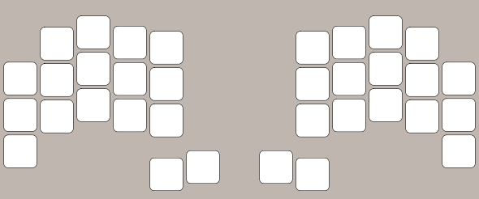

# ZMK viewer


[](https://github.com/MrMarble/zmk-viewer/actions/workflows/codeql.yml)
[](https://github.com/MrMarble/zmk-layout-viewer/actions/workflows/golangci-lint.yml)

A **work in progress** Cli tool to generate preview images from a zmk .keymap file.


## Installation

You can download a pre compiled binary directly from the [releases](https://github.com/mrmarble/zmk-viewer/releases) for your OS/Architecture.
### Linux/MacOS

I made an [installation script](/scripts/install.sh) that should download the latest available version corresponding to your OS and architecture. `sudo` is needed to copy the binary to `/usr/local/bin`

```sh
curl -sL https://raw.githubusercontent.com/MrMarble/zmk-viewer/master/scripts/install.sh | sudo -E bash -
# or with wget
wget -O - https://raw.githubusercontent.com/MrMarble/zmk-viewer/master/scripts/install.sh | sudo -E bash -
```

### Windows

Download the executable directly from the [releases](https://github.com/mrmarble/zmk-viewer/releases)

### Others

If you already have Go in your system you can use go install to build the binary without cloning the repo first.

```sh
go install github.com/mrmarble/zmk-viewer/cmd/zmk-viewer@latest # or target a specific version @v0.1.0
```
## Usage

```shell
Usage: zmk-viewer generate <keyboard-name>

Generate layout image.

Arguments:
  <keyboard-name>    Keyboard name to fetch layout.

Flags:
  -h, --help           Show context-sensitive help.
  -D, --debug          Enable debug mode
      --version        Print version information and quit

  -f, --file=STRING    ZMK .keymap file
  -t, --transparent    Use a transparent background.
  -o, --output="."     Output directory.
```

Keyboard name should be the same as in https://config.qmk.fm.

```shell
zmk-viewer generate cradio
```
Will output this image:



You can pass a .keymap file ([this one for reference](https://github.com/zmkfirmware/zmk/blob/main/app/boards/shields/cradio/cradio.keymap)) to generate the layout with bindings

```shell
zmk-viewer generate -f ~/zmk-config/config/cradio.keymap cradio
```
will output an image for each layer:


