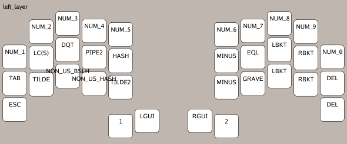
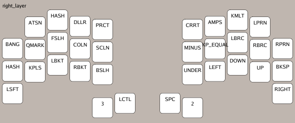

# ZMK viewer


[](https://github.com/MrMarble/zmk-layout-viewer/actions/workflows/vuln.yml)
[](https://github.com/MrMarble/zmk-layout-viewer/actions/workflows/golangci-lint.yml)

A **work in progress** Cli tool to generate preview images from a zmk .keymap file.

## Usage

```shell
Usage: zmk-viewer generate <keyboard-name>

Generate layout image.

Arguments:
  <keyboard-name>    Keyboard name to fetch layout.

Flags:
  -h, --help           Show context-sensitive help.
  -D, --debug          Enable debug mode

  -f, --file=STRING    ZMK .keymap file
  -t, --transparent    Use a transparent background.
  -o, --output="."     Output directory.
```

Keyboard name should be the same as in https://config.qmk.fm.

```shell
zmk-viewer generate cradio
```
Will output this image:


You can pass a .keymap file ([this one for reference](https://github.com/zmkfirmware/zmk/blob/main/app/boards/shields/cradio/cradio.keymap)) to generate the layout with bindings

```shell
zmk-viewer generate -f ~/zmk-config/config/cradio.keymap cradio
```
will output an image for each layer:





